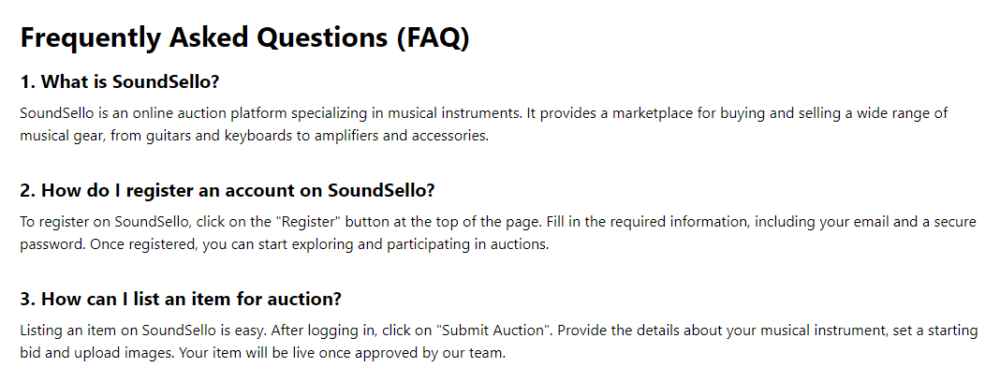
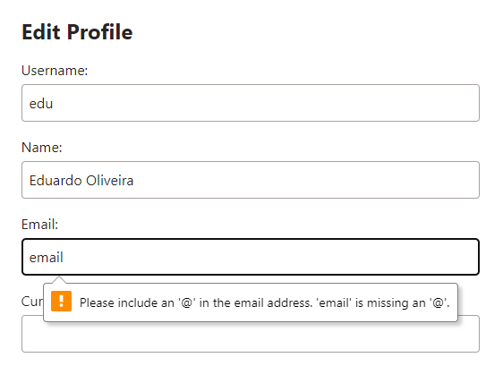
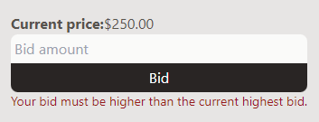
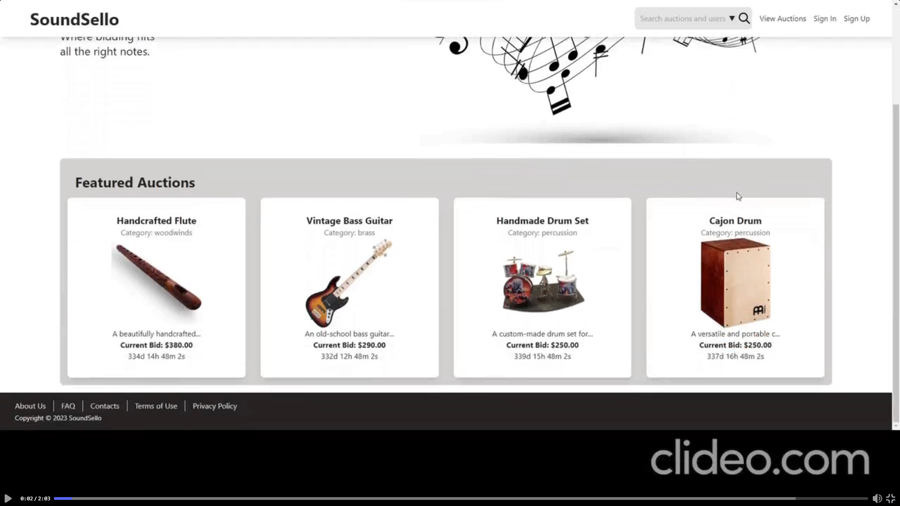

# PA: Product and Presentation

**Project vision:** SoundSello is being developed to facilitate music lovers and musical instrument collectors find what they want or need by bidding or auctioning instruments of all kinds.

## A9: Product

SoundSello in this iteration is a result of the system designed from A1 to A7, using Laravel, HTML, CSS (with Tailwind CSS), PHP, JavaScript, AJAX and PostgreSQL as a database.
This website hosts online auctions, and it was specifically made for instruments, so music lovers have a platform to easily buy and sell theirs.

### 1. Installation

The release with the final version of the source code can be found here: https://git.fe.up.pt/lbaw/lbaw2324/lbaw2322/-/tags

Full command to start the image available at the group's GitLab Container Registry using the production database:
```
docker run -it -p 8000:80 --name=lbaw2322 -e DB_DATABASE="lbaw2322" -e DB_SCHEMA="lbaw2322" -e DB_USERNAME="lbaw2322" -e DB_PASSWORD="DidGHwDG" git.fe.up.pt:5050/lbaw/lbaw2324/lbaw2322
``` 

### 2. Usage

URL to the product: http://lbaw2322.lbaw.fe.up.pt

#### 2.1. Administration Credentials

Administration URL: http://lbaw2322.lbaw.fe.up.pt/admin/users

| Email | Password |
| -------- | -------- |
| eduardo@email.com    | 1234 |

#### 2.2. User Credentials

| Type          | Email  | Password |
| ------------- | --------- | -------- |
| Regular User | daniel@email.com    | 1234 |
| System Manager | zemanel@hotmail.com | 1234 |

### 3. Application Help

These features can be seen in confirmation and error messages in some pages, and also in pages like "FAQ", "About Us", "Contacts", "Terms of Use" and "Privacy Policy", accessible from the footer in all pages accessible by normal users.



### 4. Input Validation

We used client-side validation in some user inputs, like when the user edits their profile and tries to input an empty string or a string without an "@" as their email.



> We used server-side validation in more user inputs, using mainly the function "validate" in Illuminate\Http\Request and triggers in our database, like when the user tries to make a bid lower than the current highest bid.



### 5. Check Accessibility and Usability

[Accessibility Checklist](../docs/AccessibilityChecklist.pdf): 17/18

[Usability Checklist](../docs/UsabilityChecklist.pdf): 23/28 

### 6. HTML & CSS Validation


#### HTML Validation

[AuctionPage](../docs/errorHTMLAuctionPage.pdf)

[AdminPage](../docs/errorHTMLAdminPage.pdf) - here here are errors that occur repeatidly because of a list, every row sharing the same error. 

[ActiveAuctions](../docs/errorHTMLActiveAuctions.pdf) - same with this file
    
#### CSS Validation
Since we used Tailwind CSS framework, there is no need to validate css

### 7. Revisions to the Project

1. Deleted user story for deleting auctions
2. Changed the project description to explain better how item selling works
3. Changed 'Canceled' auction to 'Disabled' auction
4. Deleted some business rules we found unnecessary or didn't make sense
5. Removed one more business rule that we found unnecessary
6. Removed one user story that we found unnecessary
7. Changed priority in one user story (US18 was medium)
8. Changed description in US31
9. Added Withdraw money user story.
10. Fixed Transaction 1 to match laravel code
11. Removed is_anonymizing from users table
12. Added user_state to UML,SQL,Relational Schema
13. Fixed triggers associated with user_state
14. Changed anonymize trigger, email not NULL now 
15. Added trigger to pause auction after relevant report
16. Added google_id, remember_token to users
17. Added categories and biography to auction and user indexes for FTS

### 8. Implementation Details

#### 8.1. Libraries Used

Libraries and Frameworks used:

<ul>
    <li><a href="https://laravel.com/">Laravel</a>: used for server-side management </li>
    <li><a href="https://tailwindcss.com/">Tailwind CSS</a>: used for frontend </li>
    <li><a href="https://laravel.com/docs/10.x/socialite">Socialite</a>: used for login and register with google </li>
    <li><a href="https://sweetalert2.github.io/">SweetAlert</a>: to make better pop ups </li>
    <li><a href="https://carbon.nesbot.com/docs/">Carbon</a>: instead of having dates, we have time since an event happend</li>
    <li><a href="https://swiperjs.com/">Stripe</a>: used for deposit </li>
    <li><a href="https://mailtrap.io/">MailStrap</a>: used for password recovery </li>
    <li><a href="https://swiperjs.com/">Swiper</a>: used to make auctions have a better UI, allowing photos to be swipped </li>
    <li><a href="https://en.wikipedia.org/wiki/Cron">Cron</a>: used for task scheduling </li>
</ul>


#### 8.2 User Stories


| US Identifier | Name    | Module | Priority                       | Team Members               | State  |
| ------------- | ------- | ------ | ------------------------------ | -------------------------- | ------ |
|  US01          | See Home Page | Module 2 | High | **Eduardo Oliveira**, Daniel Gago, Máximo Pereira, José Santos |  100%  |
|  US02          | View Active Auctions | Module 2 | High | Daniel Gago | 100% | 
|  US03          | View Auction Details | Module 3 | High | Daniel Gago | 100% | 
|  US04          | Exact match search | Module 2 | High | Máximo Pereira | 100% |
|  US05          | Full text search | Module 2 | High | Máximo Pereira | 100% | 
|  US06          | View User Profiles | Module 2 | High | Eduardo Oliveira |   100%  | 
|  US08          | Consult FAQ / Help | Module 2 | Medium | Eduardo Oliveira | 100% | 
|  US10          | Log in | Module 1 | High | Eduardo Oliveira | 100% | 
|  US11          | Register Account | Module 1 | High | Eduardo Oliveira | 100% | 
|  US13          | Log out | Module 1 | High | Eduardo Oliveira | 100% | 
|  US14          | Create Auction | Module 3 | High | Daniel Gago | 100% | 
|  US15          | Bid on Auction | Module 3 | High | Daniel Gago | 100% | 
|  US16          | View Own Profile | Module 2 | High | Eduardo Oliveira | 100% | 
|  US17          | Edit Profile | Module 2 | High | Eduardo Oliveira | 100% | 
|  US18          | Deposit Money on Account | Module 5 | High | Eduardo Oliveira | 100% | 
|  US19          | Withdraw Money from Account | Module 5 | High | Eduardo Oliveira | 100% | 
|  US21          | View My Auctions | Module 2 | Medium | Daniel Gago | 100% | 
|  US22          | View Followed Auctions | Module 2 | Medium | Daniel Gago | 100% | 
|  US29          | View Auction Bidding History | Module 3 | High | Daniel Gago | 100% | 
|  US36          | Disable Auction  | Module 3 | High | Daniel Gago | 100% | 
|  US38          | Approve Auction | Module 4 | High | José Santos | 100% | 
|  US39          | Pause Auctions | Module 4 | Medium | José Santos | 100% | 
|  US40          | Resume Auctions | Module 4 | Medium | José Santos | 100% | 
|  US44          | Manage User Accounts | Module 4 | High | José Santos | 100% | 
|  US45          | Deactivate User Accounts | Module A | Medium | José Santos | 100% | 
|  US07          | Search Filters | Module 2 | Medium | Máximo Pereira | 100% | 
|  US09          | See "About us" Page | Module 2 | Low | Eduardo Oliveira | 100% | 
|  US12          | Recover Password | Module 1 | Medium | Eduardo Oliveira | 100% | 
|  US20          | View My Bidding History | Module 2 | Medium | Daniel Gago | 100% | 
|  US23          | Delete Account | Module 2 | Medium | Eduardo Oliveira | 100% | 
|  US24          | Follow an Auction | Module 2 | Medium | Daniel Gago | 100% | 
|  US25          | Receive and View Personal Notifications | Module 2 | Medium | **Eduardo Oliveira**, Máximo Pereira, Daniel Gago, José Santos | 100% | 
|  US26          | Support Profile Picture | Module 2 | Medium | Eduardo Oliveira | 100% | 
|  US27          | Report Auctions | Module 2 | Low | Daniel Gago | 100% | 
|  US28          | Comment Auctions  | Module 2 | Low | Daniel Gago | 100% | 
|  US30          | Rate Seller | Module 2 | Medium | Daniel Gago | 100% | 
|  US31          | New bid on Participating Auction Notification | Module 2 | Medium | Eduardo Oliveira | 100% | 
|  US33          | Participating Auction Ended Notification | Module 2 | Medium | Eduardo Oliveira | 100% | 
|  US37          | My Auction's Winner | Module 3 | Medium | Daniel Gago | 100% | 
|  US41          | Disable Auctions | Module 4 | Medium | José Santos | 100% | 
|  US42          | Ban/Unban User Accounts | Module 4 | Medium | José Santos | 100% | 
|  US43          | Manage Report System | Module 4 | Medium | José Santos | 100% |  


---


## A10: Presentation
 
This artifact corresponds to the presentation of the product.

### 1. Product presentation

Are you a musician looking to buy a new guitar? Or an artifact collector looking to expand their antique collection of saxophones? If you identify with any of those descriptions, then SoundSello is the place for you. Here, after you create an account, you can start bidding right away, just deposit money into your account using our Stripe payment system and find an auction that interests you. Not sure if you want to participate in a bidding war just yet? You can follow an auction and be notified every time there is a new bid.

 Perhaps you just want to sell that old drum set that you haven't used in years. For that, submit an auction with all the information about it and send the product to our headquarters. After we review and approve it, you're free to start the auction proccess whenever you want and watch those bids come in. After it's sold, the money will be available for withdrawal in your account.

URL to the product: http://lbaw2322.lbaw.fe.up.pt  

### 2. Video presentation



[Link to the video](../docs/lbaw2322.mp4)


***
GROUP0202, 22/12/2023

* Daniel Gago, up202108791@edu.fe.up.pt (Editor)
* Eduardo Oliveira, up202108843@edu.fe.up.pt 
* José Santos, up202108729@edu.fe.up.pt
* Máximo Pereira, up202108887@edu.fe.up.pt
